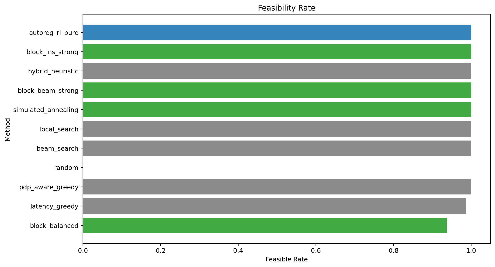
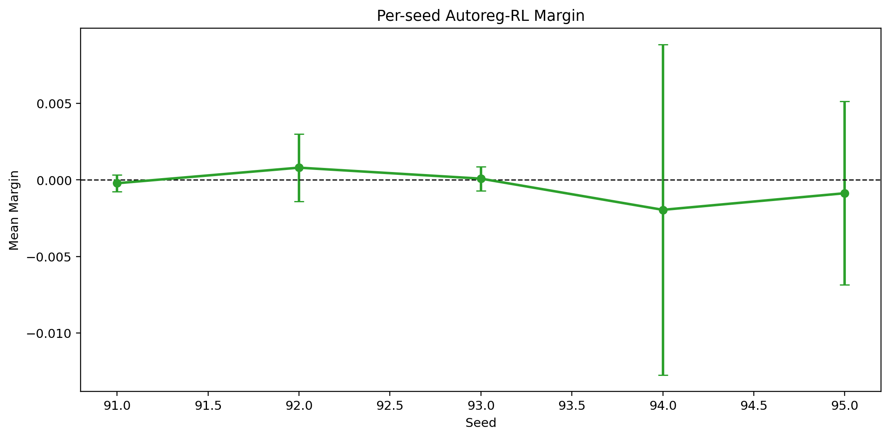
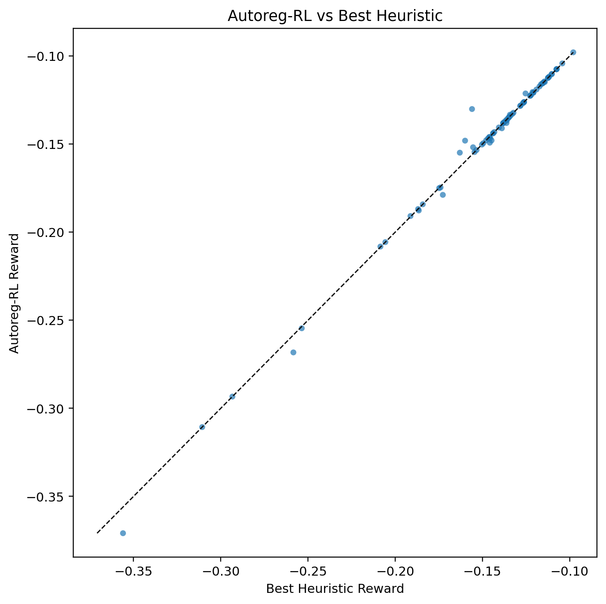

# LLM-UAV Autoregressive RL

Clean experiment repository for UAV-enabled distributed LLM submodel deployment.

The current method is a pure autoregressive RL policy for assigning Qwen3-0.6B layers to `N=5` UAVs. At inference time, `autoreg_rl_pure` samples candidates only from the learned policy and applies generic feasibility projection. Strong heuristics are used only as benchmark baselines; their actions are not inserted into the RL candidate pool.

The main reproducible result is the Qwen3-0.6B experiment below. `master` now also contains the exploratory larger-model artifacts from `qwen35-gemma-explore` for `Qwen/Qwen3.5-4B` and `google/gemma-4-E4B-it`; the original 0.6B state is preserved as tag `v0.6b-stable`.

## Current Result

Latest benchmark: `5 seeds x 64 states = 320 states`, `28` LLM layers, real Qwen3-0.6B layer-calibrated profile, CUDA inference.

Checkpoint: `results/autoreg_rl_layer_calibrated_hard_k256/autoreg_policy_best.pt`

Main benchmark: `results/benchmark_layer_calibrated_hard_k256_5seed`

New Qwen3-0.6B training runs use the same current autoregressive method as the larger-model experiments: real layer-calibrated PPL, teacher-assisted replay, block projection, and beam policy candidates. The released checkpoint above remains the validated 0.6B benchmark checkpoint.

## Observation, Action, Reward

The current setting uses `N=5` UAVs and `L=28` Qwen3-0.6B layers.

The base environment observation is a flattened vector `x in R^93`:

| component | shape | dim | normalization |
|---|---:|---:|---|
| SNR matrix | `N x N` | 25 | `log1p(snr) / log1p(1e6)` |
| packet-drop probability matrix | `N x N` | 25 | raw probability in `[0, 1]` |
| UAV compute capacity | `N` | 5 | `compute_hz / 1e10` |
| UAV memory capacity | `N` | 5 | `mem_bytes / 512 MiB` |
| UAV energy budget | `N` | 5 | `energy_j / 2000` |
| previous layer placement | `L` | 28 | `previous_uav_id / (N - 1)` |
| total |  | 93 |  |

`hover_power_w` is sampled by the simulator and affects energy feasibility during evaluation, but it is not part of the current policy observation.

At each autoregressive decoding step, the policy combines the encoded base observation with per-layer context:

| step input | shape | dim |
|---|---:|---:|
| encoded base observation | `hidden_dim` | 512 |
| current layer features: memory, compute cycles, previous activation, next activation, previous-layer importance, position | `6` | 6 |
| previous assigned UAV one-hot | `N` | 5 |
| current normalized memory used per UAV | `N` | 5 |
| current layer index fraction | `1` | 1 |
| remaining global memory fraction | `1` | 1 |
| total step input |  | 530 |

The step network outputs `N=5` logits, one for each UAV. Memory-infeasible choices are masked during sampling.

The action is the layer-to-UAV assignment vector:

```text
a = [u_0, u_1, ..., u_27], where u_l in {0, 1, 2, 3, 4}
```

For feasible deployments, the reward is:

```text
reward = -cost
cost = alpha * ((PPL_hat - PPL_ref) / PPL_ref) + beta * (latency_s / latency_ref_s)
```

The calibrated config uses `alpha = 0.4`, `beta = 0.6`, `PPL_ref = 30.811979`, and `latency_ref_s = 6.0`. Hard-infeasible deployments receive `reward = -100.0`. Feasibility is checked against UAV memory and energy budgets; communication latency is computed with KKT closed-form bandwidth allocation.

`PPL_hat` is supplied by the real-LLM-calibrated surrogate described below:

```text
PPL_hat = PPL_ref * exp(sum_l gamma_l * residual_l)
residual_l = p_l^(r + 1)
```

The current config uses one retransmission, so `r = 1` and `residual_l = p_l^2`. Retransmission affects the reward in two places: it increases expected communication latency through the expected number of attempts, and it reduces PPL damage from raw PDP `p_l` to residual loss `p_l^(r+1)`.

## RL Principle

During training, the policy samples `k=256` candidate assignments per state. The simulator evaluates all candidates with the same reward used in the benchmark. The highest-reward candidates are used for policy-gradient updates and self-imitation replay. The current training recipe can warm-start replay with teacher states collected by strong search, then continue with pure policy-gradient/self-imitation updates. Hard-state weighted replay can additionally increase the probability of revisiting states where a previous RL policy lost to the best non-RL baseline, with larger weights for larger losses.

During inference, `autoreg_rl_pure` still uses only candidates generated by the learned autoregressive policy, followed by generic feasibility projection. Strong heuristics are evaluated only as baselines and are not inserted into the RL candidate pool.

## Surrogate Principle

The paper defines PPL as token-level perplexity:

```text
PPL = exp(-1/M * sum_k log P_LLM(w_k | w_1, ..., w_{k-1}))
```

This repository now computes real Qwen3-0.6B PPL with that explicit formula. The simulator then uses a real-LLM-calibrated analytic surrogate:

```text
PPL_hat = PPL_ref * exp(sum_l gamma_l * residual_l)
residual_l = p_l^(r + 1)
```

The PDP-to-PPL path is:

1. A wireless boundary exists only when adjacent layers are placed on different UAVs: `a_l != a_{l+1}`.
2. The simulator reads the raw link PDP `p_l = PDP[a_l, a_{l+1}]`.
3. With `r` retransmissions, the residual loss probability after all attempts is `p_l^(r+1)`. For the current config, `r = 1`, so the PPL damage term uses `p_l^2`.
4. Each boundary layer has a fitted sensitivity `gamma_l`. Higher `gamma_l` means packet loss after that layer hurts PPL more.
5. The total log-PPL increase is `sum_l gamma_l * p_l^(r+1)`, and the simulator returns `PPL_hat = PPL_ref * exp(total log-PPL increase)`.

In code this is stored as `profile.importance_l = gamma_l / sum(gamma_l)` and `profile.ppl_gamma = sum(gamma_l)`, so `profile.ppl_gamma * sum_l importance_l * residual_l` is equivalent to `sum_l gamma_l * residual_l`.

`gamma_l` is not hand-written: it is fitted by loading Qwen3-0.6B, corrupting each boundary layer's hidden states at controlled drop rates, and measuring the resulting real PPL. The fitted layer sensitivities are stored in `results/qwen3_0p6b_real_profile/layer_ppl_gamma.npy`. The layer-wise calibration used drop rates `0.0`, `0.01`, `0.03`, and `0.05`; the embedding-level stress curve additionally includes up to `0.1`.

Profile calibration:

| item | value |
|---|---:|
| model | `Qwen/Qwen3-0.6B` |
| parameters | 596,049,920 |
| layers | 28 |
| hidden size | 1024 |
| dtype | bfloat16 |
| reference PPL | 30.811979 |
| embedding-curve gamma | 10.898646 |
| embedding-curve R2 | 0.997363 |
| layer gamma sum | 293.322997 |
| layer mean R2 | 0.982527 |
| layer RMSE log-ratio | 0.018681 |

## Benchmark

There are three different benchmark layers in this repository. The simulator benchmark is the main policy-comparison benchmark and uses the calibrated surrogate `PPL_hat`. Real-LLM validation then loads the model and recomputes PPL for selected deployment actions. Surrogate calibration measures whether the fitted PDP-to-PPL model is trustworthy before running policy benchmarks.

| model | simulator surrogate benchmark | real LLM action-level validation | surrogate calibration status |
|---|---|---|---|
| `Qwen/Qwen3-0.6B` | main result, `320` states, RL win/tie `0.8125` vs best non-RL | done, `64` competitive action rows, mean rel error `0.023323` | good: layer R2 `0.982527`, RMSE log-ratio `0.018681` |
| `Qwen/Qwen3.5-4B` | experimental, `80` states, RL win/tie `0.8250` vs best non-RL | not run yet for action-level PPL validation | good v2 profile: layer R2 `0.995787`, RMSE log-ratio `0.006596` |
| `google/gemma-4-E4B-it` | not reported | not run | not reliable: clean PPL `32287.1`, embedding surrogate R2 `< 0` |

### Simulator Surrogate Benchmarks

These benchmarks compare RL against strong non-RL deployment baselines inside the LLM-UAV simulator. The PPL column is `PPL_hat`, computed by the calibrated surrogate, not by loading the LLM for every simulator state.

| model | artifact | states | policy | reward | best non-RL reward | latency | PPL_hat | runtime_s | margin | win/tie |
|---|---|---:|---|---:|---:|---:|---:|---:|---:|---:|
| Qwen3-0.6B | `results/benchmark_layer_calibrated_hard_k256_5seed` | 320 | `autoreg_rl_pure_k256_hard` | -0.497273 +/- 0.791419 | -0.499117 | 2.6278 | 48.8752 | 0.03475 | +0.001844 | 0.8125 |
| Qwen3.5-4B | `results/benchmark_qwen35_4b_v2_teacher_big_5seed` | 80 | `autoreg_rl_pure` | -0.146974 +/- 0.047001 | -0.147090 | 4.4509 | 12.8052 | 0.05259 | +0.000116 | 0.8250 |

For Qwen3-0.6B, the strongest baseline set includes `hybrid_heuristic`, `block_lns_strong`, `block_beam_strong`, `beam_search`, `simulated_annealing`, `local_search`, `pdp_aware_greedy`, `latency_greedy`, `block_balanced`, and `random`. Runtime is measured separately for every method.

Qwen3-0.6B method table:

| method | reward | feasible | latency | PPL_hat | runtime_s |
|---|---:|---:|---:|---:|---:|
| autoreg_rl_pure_k256_hard | -0.497273 +/- 0.791419 | 1.0000 | 2.6278 | 48.8752 | 0.03475 |
| hybrid_heuristic | -0.499117 +/- 0.787499 | 1.0000 | 2.6578 | 48.7862 | 0.01226 |
| block_lns_strong | -0.499191 +/- 0.787523 | 1.0000 | 2.6519 | 48.8368 | 0.06524 |
| block_beam_strong | -0.584792 +/- 1.109608 | 1.0000 | 2.7353 | 54.7887 | 0.30765 |
| simulated_annealing | -13.754920 +/- 31.010895 | 0.8906 | 18.0197 | 1.3716e29 | 0.00682 |
| local_search | -13.771714 +/- 31.006918 | 0.8906 | 18.0157 | 1.3716e29 | 0.01457 |
| beam_search | -17.326284 +/- 290.588877 | 1.0000 | 2.8847 | 1343.2341 | 0.03031 |
| random | -100.000000 +/- 0.000000 | 0.0000 | 110.9442 | 5.0923e32 | 0.02311 |
| pdp_aware_greedy | -1076.841052 +/- 10055.860361 | 0.9969 | 3.4499 | 1338960.5587 | 0.00033 |
| block_balanced | -13061686.697982 +/- 112969291.344464 | 0.8281 | 14.6489 | 4.0152e12 | 0.00008 |
| latency_greedy | -127873524.298005 +/- 952102671.473644 | 0.9250 | 9.7239 | 3.7472e10 | 0.00007 |

Qwen3.5-4B method table:

| method | reward | feasible | latency | PPL_hat | runtime_s |
|---|---:|---:|---:|---:|---:|
| autoreg_rl_pure | -0.146974 | 1.0000 | 4.4509 | 12.8052 | 0.05259 |
| hybrid_heuristic | -0.147090 | 1.0000 | 4.4668 | 12.7940 | 0.01355 |
| block_lns_strong | -0.147090 | 1.0000 | 4.4668 | 12.7940 | 0.06099 |
| block_beam_strong | -0.148220 | 1.0000 | 4.4904 | 12.8071 | 0.66905 |
| simulated_annealing | -0.847906 | 1.0000 | 5.1566 | 33.8587 | 0.00677 |
| local_search | -0.849439 | 1.0000 | 5.1624 | 33.9007 | 0.01624 |
| beam_search | -3.568186 | 1.0000 | 4.7848 | 118.4562 | 0.06955 |

Qwen3-0.6B candidate-budget sweep before hard-state replay:

| k | mean margin | min margin | win/tie | strict win | runtime_s |
|---:|---:|---:|---:|---:|---:|
| 16 | -0.13527882 | -13.85941523 | 0.3656 | 0.0625 | 0.02870 |
| 64 | -0.04158387 | -7.88135706 | 0.5781 | 0.1062 | 0.03312 |
| 128 | -0.00694286 | -1.12779709 | 0.6750 | 0.1344 | 0.03698 |
| 256 | -0.00063242 | -1.06510871 | 0.7781 | 0.1500 | 0.04297 |

Hard-state replay changed the Qwen3-0.6B mean margin from `-0.000632` to `+0.001844` and the win/tie rate from `0.7781` to `0.8125`. On the 71 replayed hard states, mean margin improved from `-0.047767` to `-0.025147`.

### Real LLM Validation

Real LLM validation loads the model and recomputes paper-formula PPL for selected deployment actions. This is much slower than the simulator benchmark, so it is used to validate surrogate quality rather than to train or evaluate every benchmark state.

Real-LLM profile and loading results:

| model | real profile artifact | clean PPL | forward latency | status |
|---|---|---:|---:|---|
| Qwen3-0.6B | `results/qwen3_0p6b_real_profile` | 30.811979 | 30.24 ms | usable, main validated model |
| Qwen3.5-4B | `results/qwen35_4b_real_profile_v2` | 12.388740 | 167.91 ms | usable simulator profile, action-level validation pending |
| Gemma-4-E4B-it | `results/gemma4_e4b_it_real_profile` | 32287.077197 | 1624.34 ms | loads, but PPL pipeline is not reliable |

| model | artifact | rows | methods | mean rel error | max rel error | RMSE log-ratio | Pearson | Spearman | status |
|---|---|---:|---|---:|---:|---:|---:|---:|---|
| Qwen3-0.6B | `results/real_action_ppl_validation_layer_calibrated_retrained` | 64 competitive | RL + 3 strong baselines | 0.023323 | 0.216265 | 0.052984 | 0.996233 | 0.973764 | validated |
| Qwen3.5-4B | not available | 0 | - | - | - | - | - | - | pending |
| Gemma-4-E4B-it | not available | 0 | - | - | - | - | - | - | blocked by invalid clean PPL |

Qwen3-0.6B real-LLM validation by method:

| method | rows | mean rel error | max rel error | RMSE log-ratio | Pearson | Spearman |
|---|---:|---:|---:|---:|---:|---:|
| autoreg_rl_pure | 16 | 0.024563 | 0.113034 | 0.045242 | 0.998831 | 0.973529 |
| block_beam_strong | 16 | 0.026895 | 0.216265 | 0.064827 | 0.997296 | 0.970588 |
| block_lns_strong | 16 | 0.024521 | 0.199763 | 0.059132 | 0.997366 | 0.976471 |
| hybrid_heuristic | 16 | 0.017314 | 0.134010 | 0.038514 | 0.998837 | 0.976471 |

Random high-transition actions are kept in the real-LLM report as out-of-distribution stress cases. They can exceed the calibrated drop range and produce very large exponential extrapolation errors, so the main validation metric is the non-random competitive subset.

### Surrogate Calibration Benchmarks

Surrogate calibration is the model-level check that real LLM PPL behaves predictably under controlled hidden-state corruption. These results determine whether a model is usable for the simulator benchmark.

| model | clean PPL | layer gamma sum | layer R2 | RMSE log-ratio | action-level real validation | simulator status |
|---|---:|---:|---:|---:|---|---|
| Qwen3-0.6B | 30.811979 | 293.322997 | 0.982527 | 0.018681 | done | main benchmark |
| Qwen3.5-4B v2 | 12.388740 | 206.094048 | 0.995787 | 0.006596 | pending | experimental benchmark |
| Gemma-4-E4B-it | 32287.077197 | n/a | n/a | n/a | not run | blocked |

The standalone Qwen3-0.6B surrogate curve benchmark is stored in `results/surrogate_benchmark`. It validates the exponential PPL model against measured Qwen3-0.6B PPL under controlled corruption before the simulator benchmark and real action-level validation.

| metric | value |
|---|---:|
| PPL_ref | 30.811979 |
| gamma | 10.898646 |
| layer gamma sum | 293.322997 |
| layer mean R2 | 0.982527 |
| R2 log-ratio | 0.997363 |
| RMSE log-ratio | 0.019289 |
| MAE PPL | 0.797233 |
| mean relative PPL error | 0.015285 |
| max relative PPL error | 0.030760 |

Gemma-4-E4B-it can be loaded, but the current text-only PPL evaluation gives clean PPL `32287.1` and a negative embedding surrogate R2. That means the current tokenizer/prompt/PPL pipeline is not valid enough for simulator or RL comparison; Gemma benchmark results should wait until the Gemma-specific PPL evaluation is fixed.

## Visuals

### Qwen3-0.6B Main Result


### Qwen3.5-4B Teacher-Big









[Visual summary](results/visuals_qwen35_teacher_big/visual_summary.md)


## Reproduce

Train a new Qwen3-0.6B policy with the current environment and surrogate. The config already points to `results/qwen3_0p6b_real_profile`, so `--real-dir` is optional:

```powershell
python -m src.train_autoreg_rl `
  --config configs/qwen3_calibrated.yaml `
  --out results/autoreg_rl_qwen3_0p6b_teacher_big `
  --device cuda `
  --episodes 2000 `
  --batch-states 32 `
  --candidates 256 `
  --eval-candidates 256 `
  --validation-states 160 `
  --teacher-states 1000 `
  --teacher-updates 1000 `
  --teacher-top-k 6 `
  --teacher-weight-tau 0.012 `
  --teacher-min-margin 0.03 `
  --projection-mode blocks `
  --max-blocks 5 `
  --candidate-mode beam `
  --beam-temperature 0.9
```

The released checkpoint was additionally fine-tuned with hard-state weighted replay. The replayed hard states are recorded in `results/autoreg_rl_layer_calibrated_hard_k256/hard_states_used.csv`; older intermediate benchmark directories are intentionally not tracked. To continue a teacher checkpoint with the same hard-state replay recipe, pass `--init-policy`, `--hard-benchmark-rows`, `--hard-max-states`, and `--hard-fraction` as in `results/autoreg_rl_layer_calibrated_hard_k256/config_used.json`.

Run the recommended `k=256` benchmark:

```powershell
python -m src.benchmark_real_profile `
  --config configs/qwen3_calibrated.yaml `
  --policy results/autoreg_rl_layer_calibrated_hard_k256/autoreg_policy_best.pt `
  --states 64 `
  --seeds "91,92,93,94,95" `
  --beam-width 32 `
  --anneal-steps 128 `
  --autoreg-candidates 256 `
  --autoreg-refine-steps 0 `
  --projection-mode blocks_fast `
  --max-blocks 5 `
  --candidate-mode beam `
  --beam-temperature 1.0 `
  --out results/benchmark_layer_calibrated_hard_k256_5seed `
  --device cuda
```

Run real action-level PPL validation:

```powershell
python -m src.benchmark_real_action_ppl `
  --config configs/qwen3_calibrated.yaml `
  --llm-config configs/real_llm.yaml `
  --policy results/autoreg_rl_layer_calibrated_hard_k256/autoreg_policy_best.pt `
  --states 16 `
  --repeats 2 `
  --batch-size 4 `
  --methods "autoreg_rl_pure,hybrid_heuristic,block_lns_strong,block_beam_strong,random" `
  --autoreg-candidates 256 `
  --beam-width 32 `
  --anneal-steps 128 `
  --out results/real_action_ppl_validation_layer_calibrated_retrained
```

Regenerate visuals:

```powershell
python -m src.make_visuals `
  --train-dir results/autoreg_rl_layer_calibrated_hard_k256 `
  --benchmark-dir results/benchmark_layer_calibrated_hard_k256_5seed `
  --out results/visuals_layer_calibrated_hard_k256
```

## Repository Layout

```text
.
|-- configs/
|   |-- qwen3_calibrated.yaml        # main Qwen3-0.6B simulator config
|   |-- real_llm.yaml                # real Qwen3-0.6B loading/PPL validation config
|   |-- qwen35_4b_calibrated.yaml    # experimental Qwen3.5-4B simulator config
|   |-- real_llm_qwen35_4b.yaml      # Qwen3.5-4B deployment/profile config
|   `-- real_llm_gemma4b.yaml        # Gemma-4-E4B-it deployment/profile config
|-- docs/
|   |-- llm_deployment_exploration.md
|   `-- qwen35_gemma_benchmark.md
|-- src/
|   |-- env.py                       # LLM-UAV environment, hard constraints, reward, KKT bandwidth allocation
|   |-- channel.py                   # wireless channel and packet-drop modeling
|   |-- llm_profile.py               # synthetic and real-calibrated Qwen3-0.6B layer profile builders
|   |-- autoreg_rl_agent.py          # masked autoregressive RL policy
|   |-- train_autoreg_rl.py          # RL/self-imitation training entry point
|   |-- baselines.py                 # greedy, beam, local search, annealing, block LNS, hybrid heuristics
|   |-- benchmark_real_profile.py    # simulator benchmark against strong baselines
|   |-- benchmark_real_action_ppl.py # real LLM action-level PPL validation
|   |-- benchmark_surrogate.py       # surrogate-vs-real-PPL calibration benchmark
|   |-- real_llm_profile.py          # paper-formula PPL computation with Qwen3-0.6B
|   |-- real_llm_layer_calibration.py # layer-wise hidden-state corruption calibration
|   `-- make_visuals.py              # README/report figures
|-- results/
|   |-- autoreg_rl_layer_calibrated_hard_k256/       # released RL checkpoint and training logs
|   |-- benchmark_layer_calibrated_hard_k256_5seed/  # main 5-seed benchmark
|   |-- visuals_layer_calibrated_hard_k256/          # figures embedded in this README
|   |-- qwen3_0p6b_real_profile/                     # real Qwen3 calibration artifacts
|   |-- qwen35_4b_real_profile/                      # experimental Qwen3.5-4B calibration artifacts
|   |-- qwen35_4b_real_profile_v2/                   # high-quality Qwen3.5-4B calibration + optional MLP surrogate
|   |-- gemma4_e4b_it_real_profile/                  # Gemma deployment/profile artifacts
|   |-- autoreg_rl_qwen35_4b_hard/                   # experimental Qwen3.5-4B checkpoint
|   |-- autoreg_rl_qwen35_4b_v2_hard/                # v2 Qwen3.5-4B checkpoint
|   |-- autoreg_rl_qwen35_4b_v2_teacher/             # teacher-assisted v2 Qwen3.5-4B checkpoint
|   |-- autoreg_rl_qwen35_4b_v2_teacher_big/         # expanded teacher-assisted Qwen3.5-4B checkpoint
|   |-- benchmark_qwen35_4b_hard_5seed/              # experimental Qwen3.5-4B benchmark
|   |-- benchmark_qwen35_4b_v2_hard_5seed/           # v2 Qwen3.5-4B benchmark
|   |-- benchmark_qwen35_4b_v2_teacher_5seed/        # teacher-assisted v2 Qwen3.5-4B benchmark
|   |-- benchmark_qwen35_4b_v2_teacher_big_5seed/    # expanded teacher-assisted Qwen3.5-4B benchmark
|   |-- visuals_qwen35_teacher_big/                  # expanded Qwen3.5-4B figures
|   |-- real_action_ppl_validation_layer_calibrated_retrained/
|   `-- surrogate_benchmark/
|-- requirements.txt
`-- README.md
```

Generated experiment outputs are ignored by default. The repository tracks only the released checkpoint, the current benchmark/validation artifacts, calibration files, and README figures.

## Setup

```powershell
conda create -n LLM-UAV python=3.11 -y
conda activate LLM-UAV
pip install numpy pandas pyyaml matplotlib transformers datasets
pip install torch --index-url https://download.pytorch.org/whl/cu128
```
