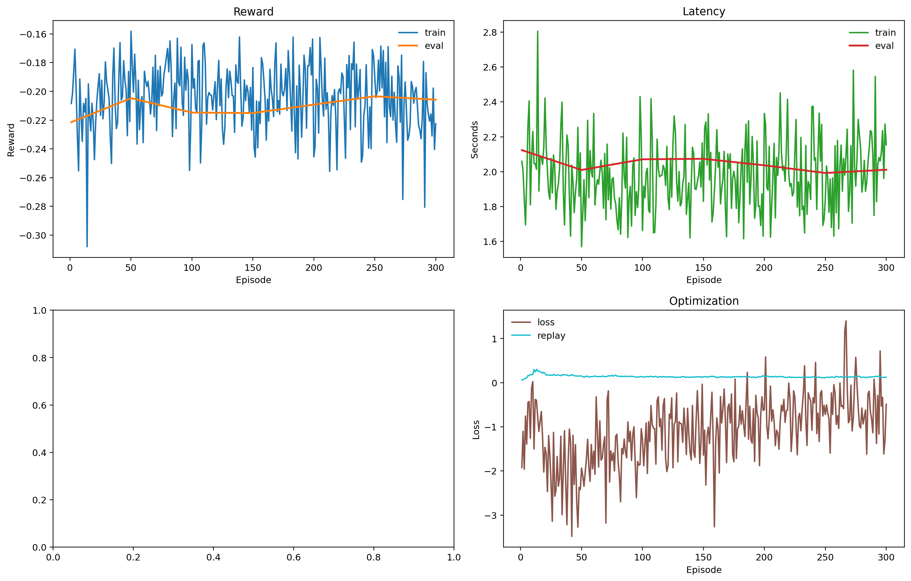
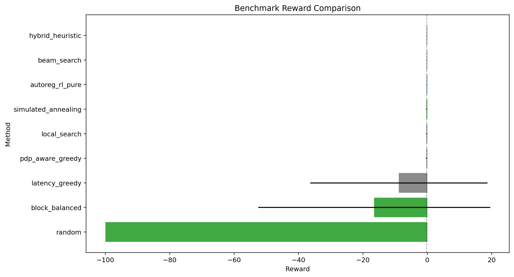
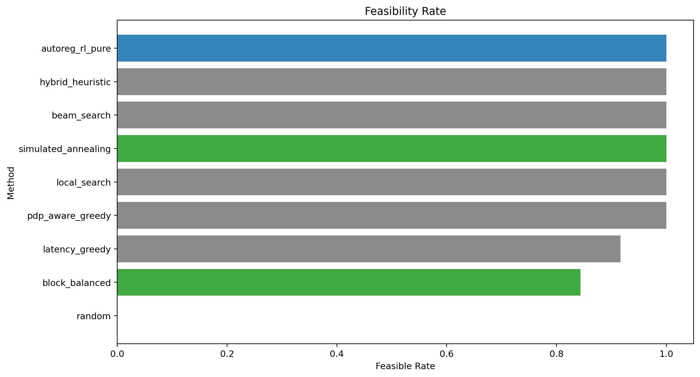
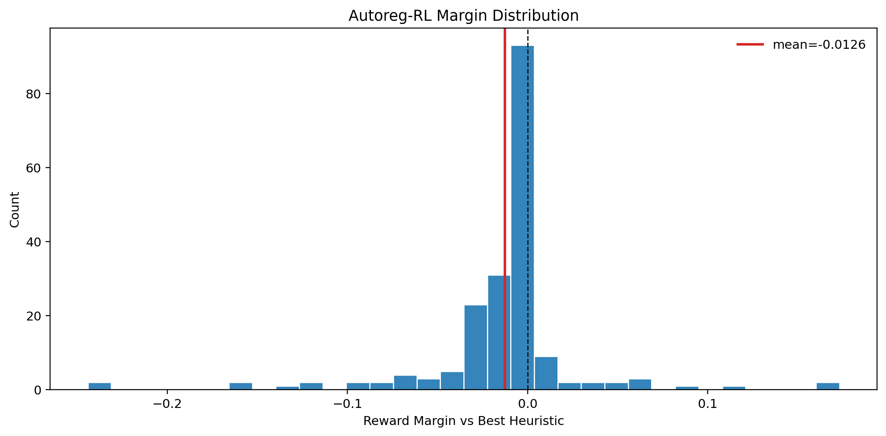
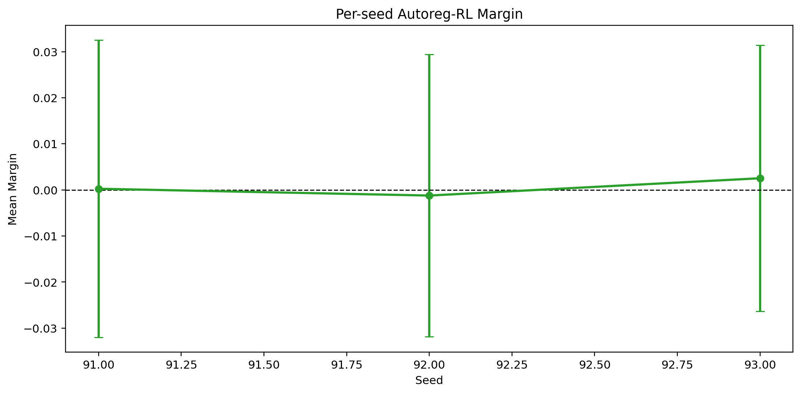
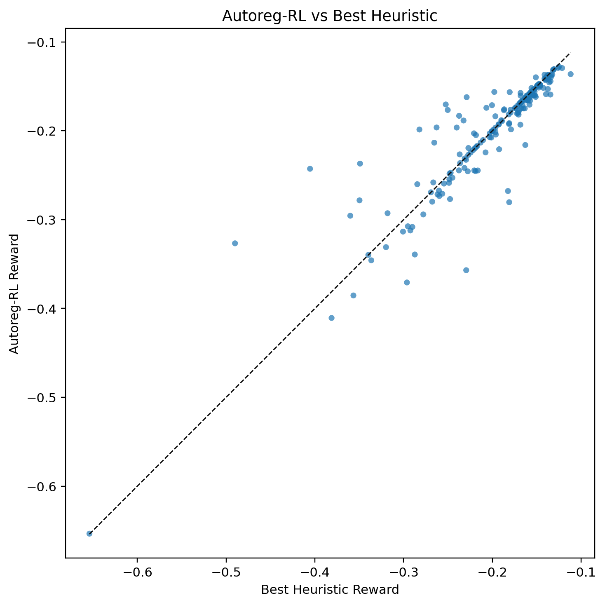
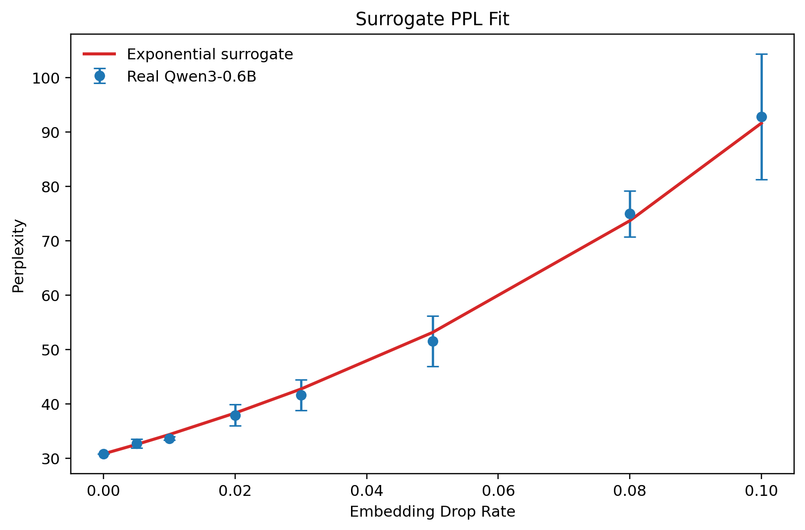

# LLM-UAV Autoregressive RL

Clean experiment repository for UAV-enabled distributed LLM submodel deployment.

The main result is a teacher-warm-start autoregressive RL policy for Qwen3-0.6B profile-based simulation. At inference time, `autoreg_rl_pure` samples deployment candidates only from the learned policy and applies generic feasibility projection. It does not insert beam-search, local-search, simulated-annealing, or greedy heuristic actions into the RL candidate pool.

## Current Result

Latest target benchmark: `5 seeds x 64 states = 320 states`, `N=5` UAVs, `28` LLM layers, real Qwen3-0.6B profile, evaluated on CUDA.

Reward is the negative weighted cost for feasible deployments:

```text
reward = -cost
cost = alpha * ((PPL_hat - PPL_ref) / PPL_ref) + beta * (latency_s / latency_ref_s)
```

Hard-infeasible deployments receive `reward = -100.0`. The calibrated config uses `alpha = 0.4`, `beta = 0.6`, `latency_ref_s = 6.0`, and `PPL_ref = 30.824672`.

The primary fair comparison sweeps the RL candidate budget over `k=16/64/256`. All RL rows use only learned-policy candidates with policy-beam decoding and generic feasibility projection. No strong heuristic actions are inserted into the RL pool.

Checkpoint: `results/autoreg_rl_real_k16_blocks/autoreg_policy_best.pt`
Benchmark: `results/benchmark_real_profile_k_sweep_5seed`

| method | reward | feasible | latency | PPL | runtime/state | margin | win/tie |
|---|---:|---:|---:|---:|---:|---:|---:|
| autoreg_rl_pure_k256 | -0.255559 +/- 0.066184 | 1.0000 | 2.4919 | 31.3157 | 0.06565s | 0.017895 | 0.9500 |
| autoreg_rl_pure_k64 | -0.257609 +/- 0.067512 | 1.0000 | 2.5106 | 31.3289 | 0.03110s | 0.015845 | 0.8625 |
| autoreg_rl_pure_k16 | -0.263797 +/- 0.074131 | 1.0000 | 2.5672 | 31.3703 | 0.02796s | 0.009656 | 0.6687 |
| baseline:hybrid_heuristic | -0.273453 +/- 0.086901 | 1.0000 | 2.6411 | 31.5446 | 0.01120s |  |  |
| baseline:beam_search | -0.278149 +/- 0.094707 | 1.0000 | 2.6786 | 31.6178 | 0.01120s |  |  |
| baseline:simulated_annealing | -0.351507 +/- 0.146873 | 1.0000 | 3.2171 | 33.1205 | 0.01120s |  |  |
| baseline:local_search | -0.352602 +/- 0.148446 | 1.0000 | 3.2242 | 33.1506 | 0.01120s |  |  |
| baseline:pdp_aware_greedy | -0.369239 +/- 0.178122 | 1.0000 | 3.3570 | 33.4093 | 0.01120s |  |  |

Candidate-budget trend: `k=16` reaches `66.875%` win/tie, `k=64` reaches `86.25%`, and `k=256` reaches `95.0%`. Full summary: `results/benchmark_real_profile_k_sweep_5seed/k_sweep_report.md`.

## Visuals













## Real LLM Benchmark

The real-model check loads `Qwen/Qwen3-0.6B` with `bfloat16` on CUDA and measures the profile used by the simulator. The full baseline comparison then uses the measured layer parameter counts, reference PPL, and fitted corruption curve in the LLM-UAV environment.

Profile results are stored in `results/qwen3_0p6b_real_profile`. The strongest real-profile benchmarks are stored in `results/benchmark_real_profile_k16_blocks_policy_beam_over4_5seed`, `results/benchmark_real_profile_k64_blocks_policy_beam_5seed`, `results/benchmark_real_profile_k256_blocks_policy_beam_5seed`, and the combined sweep in `results/benchmark_real_profile_k_sweep_5seed`.

| item | value |
|---|---:|
| model | `Qwen/Qwen3-0.6B` |
| parameters | 596,049,920 |
| layers | 28 |
| hidden size | 1024 |
| layer params mean | 15,730,944 |
| dtype | bfloat16 |
| forward latency mean | 38.422 ms |
| reference PPL | 30.824672 |
| fitted gamma | 10.899648 |
| surrogate fit R2 | 0.997366 |
| log-ratio RMSE | 0.019277 |

Real-profile baseline comparison, `5 seeds x 64 states`, `k=256`, `max_blocks=5`, `candidate_mode=beam`:

| method | reward | feasible | latency | PPL | runtime/state |
|---|---:|---:|---:|---:|---:|
| autoreg_rl_pure | -0.255559 +/- 0.066184 | 1.0000 | 2.4919 | 31.3157 | 0.06565s |
| hybrid_heuristic | -0.273453 +/- 0.086901 | 1.0000 | 2.6411 | 31.5446 | 0.01120s |
| beam_search | -0.278149 +/- 0.094707 | 1.0000 | 2.6786 | 31.6178 | 0.01120s |
| simulated_annealing | -0.351507 +/- 0.146873 | 1.0000 | 3.2171 | 33.1205 | 0.01120s |
| local_search | -0.352602 +/- 0.148446 | 1.0000 | 3.2242 | 33.1506 | 0.01120s |
| pdp_aware_greedy | -0.369239 +/- 0.178122 | 1.0000 | 3.3570 | 33.4093 | 0.01120s |
| latency_greedy | -6.340535 +/- 22.905382 | 0.9437 | 8.3329 | 43.5884 | 0.01120s |
| block_balanced | -13.781014 +/- 33.106199 | 0.8719 | 12.7195 | 48.6002 | 0.01120s |
| random | -100.000000 +/- 0.000000 | 0.0000 | 109.9627 | 102.5448 | 0.01120s |

Mean margin of `autoreg_rl_pure` vs the best non-RL heuristic on the real-profile benchmark: `0.01789450`. Win/tie rate: `0.9500`.

### Real-Profile k=16 Block Policy

The `k=16` target run uses the real Qwen3-0.6B profile, reward-weighted teacher warm start, a pure RL block projection decoder, and a pure policy beam candidate generator. It overgenerates policy-beam candidates by `4x`, deduplicates them, then keeps the final `k=16`. Inference still uses only learned-policy candidates; no baseline beam-search, local-search, simulated-annealing, or greedy heuristic actions are inserted into the RL candidate pool.

Checkpoint: `results/autoreg_rl_real_k16_blocks/autoreg_policy_best.pt`
Benchmark: `results/benchmark_real_profile_k16_blocks_policy_beam_over4_5seed`

Real-profile baseline comparison, `5 seeds x 64 states`, `k=16`, `max_blocks=5`, `candidate_mode=beam`, `candidate_overgenerate=4`:

| method | reward | feasible | latency | PPL | runtime/state |
|---|---:|---:|---:|---:|---:|
| autoreg_rl_pure | -0.263797 +/- 0.074131 | 1.0000 | 2.5672 | 31.3703 | 0.02796s |
| hybrid_heuristic | -0.273453 +/- 0.086901 | 1.0000 | 2.6411 | 31.5446 | 0.01104s |
| beam_search | -0.278149 +/- 0.094707 | 1.0000 | 2.6786 | 31.6178 | 0.01104s |
| simulated_annealing | -0.351507 +/- 0.146873 | 1.0000 | 3.2171 | 33.1205 | 0.01104s |
| local_search | -0.352602 +/- 0.148446 | 1.0000 | 3.2242 | 33.1506 | 0.01104s |
| pdp_aware_greedy | -0.369239 +/- 0.178122 | 1.0000 | 3.3570 | 33.4093 | 0.01104s |

Mean margin of `autoreg_rl_pure` vs the best non-RL heuristic: `0.00965595`. Win/tie rate: `0.6687`.

Reproduce it with:

```powershell
python -m src.benchmark_real_profile `
  --config configs/qwen3_calibrated.yaml `
  --real-dir results/qwen3_0p6b_real_profile `
  --policy results/autoreg_rl_real_k16_blocks/autoreg_policy_best.pt `
  --states 64 `
  --seeds "91,92,93,94,95" `
  --beam-width 32 `
  --anneal-steps 128 `
  --autoreg-candidates 16 `
  --autoreg-refine-steps 0 `
  --projection-mode blocks `
  --max-blocks 5 `
  --candidate-mode beam `
  --beam-temperature 1.5 `
  --candidate-overgenerate 4 `
  --out results/benchmark_real_profile_k16_blocks_policy_beam_over4_5seed `
  --device cuda
```

Reproduce the relaxed `k=64` run with:

```powershell
python -m src.real_llm_profile --config configs/real_llm.yaml
python -m src.benchmark_real_profile `
  --config configs/qwen3_calibrated.yaml `
  --real-dir results/qwen3_0p6b_real_profile `
  --policy results/autoreg_rl_real_k16_blocks/autoreg_policy_best.pt `
  --states 64 `
  --seeds "91,92,93,94,95" `
  --beam-width 32 `
  --anneal-steps 128 `
  --autoreg-candidates 64 `
  --autoreg-refine-steps 0 `
  --projection-mode blocks `
  --max-blocks 5 `
  --candidate-mode beam `
  --beam-temperature 1.0 `
  --out results/benchmark_real_profile_k64_blocks_policy_beam_5seed `
  --device cuda
```

Reproduce the `k=256` run and combined k-sweep report with:

```powershell
python -m src.benchmark_real_profile `
  --config configs/qwen3_calibrated.yaml `
  --real-dir results/qwen3_0p6b_real_profile `
  --policy results/autoreg_rl_real_k16_blocks/autoreg_policy_best.pt `
  --states 64 `
  --seeds "91,92,93,94,95" `
  --beam-width 32 `
  --anneal-steps 128 `
  --autoreg-candidates 256 `
  --autoreg-refine-steps 0 `
  --projection-mode blocks `
  --max-blocks 5 `
  --candidate-mode beam `
  --beam-temperature 1.0 `
  --out results/benchmark_real_profile_k256_blocks_policy_beam_5seed `
  --device cuda

python -m src.make_k_sweep_report
```

## Surrogate Benchmark

The surrogate benchmark is placed last because it validates the PPL model used by both the surrogate and real-profile deployment experiments. It compares the exponential surrogate `PPL_hat = PPL_ref * exp(gamma * damage)` against measured Qwen3-0.6B PPL under controlled embedding corruption.

Results are stored in `results/surrogate_benchmark`.



| metric | value |
|---|---:|
| PPL_ref | 30.824672 |
| gamma | 10.899648 |
| R2 log-ratio | 0.997366 |
| RMSE log-ratio | 0.019277 |
| MAE PPL | 0.796831 |
| Max abs PPL error | 1.587679 |
| Mean relative PPL error | 0.015270 |
| Max relative PPL error | 0.030786 |

## Repository Layout

- `src/autoreg_rl_agent.py`: masked autoregressive policy for layer-to-UAV assignment.
- `src/train_autoreg_rl.py`: teacher warm-start plus RL/self-imitation training.
- `src/benchmark_autoreg.py`: fair benchmark against strong heuristics.
- `src/exact_optimal_compare.py`: exact exhaustive comparison on reduced 5-UAV instances.
- `src/baselines.py`: greedy, local search, beam search, simulated annealing, and hybrid heuristic.
- `src/env.py`: LLM-UAV simulator, constraints, reward, KKT bandwidth allocation.
- `src/real_llm_profile.py`: Qwen3-0.6B profile/PPL calibration script.
- `configs/qwen3_calibrated.yaml`: calibrated simulation config.
- `results/autoreg_rl_teacher/autoreg_policy_best.pt`: best policy checkpoint.
- `results/benchmark_autoreg_gpu_k64`: latest full CUDA benchmark with `k=64`.
- `results/visuals_autoreg`: generated figures embedded above.

## Setup

```powershell
conda create -n LLM-UAV python=3.11 -y
conda activate LLM-UAV
pip install numpy pandas pyyaml matplotlib transformers datasets
pip install torch --index-url https://download.pytorch.org/whl/cu128
```

Use the existing local environment if it already exists:

```powershell
conda activate LLM-UAV
python -c "import torch; print(torch.__version__, torch.version.cuda, torch.cuda.is_available())"
```

## Reproduce Benchmark

```powershell
python -m src.benchmark_autoreg `
  --config configs/qwen3_calibrated.yaml `
  --policy results/autoreg_rl_teacher/autoreg_policy_best.pt `
  --states 64 `
  --seeds "91,92,93" `
  --beam-width 32 `
  --anneal-steps 128 `
  --autoreg-candidates 64 `
  --autoreg-refine-steps 0 `
  --out results/benchmark_autoreg_repro `
  --device cuda
```

## Exact Optimal Check

The full `28 layers x 5 UAV` problem is too large for exhaustive search. For a true optimality check, keep `N=5` and reduce the number of layers:

```powershell
python -m src.exact_optimal_compare `
  --config configs/qwen3_calibrated.yaml `
  --policy results/autoreg_rl_exact_L7_N5/autoreg_policy_best.pt `
  --out results/exact_optimal_L7_N5_repro `
  --num-layers 7 `
  --num-uavs 5 `
  --states 64 `
  --max-states 1000000 `
  --autoreg-candidates 2048
```

The checked run in `results/exact_optimal_L7_N5_learned` enumerates `5^7 = 78125` assignments per state. In that reduced 5-UAV setting, the strongest heuristic matches the exact optimum, while `autoreg_rl_pure` remains close with mean optimality gap `0.000294`.

## Train

```powershell
python -m src.train_autoreg_rl `
  --config configs/qwen3_calibrated.yaml `
  --out results/autoreg_rl_teacher_repro `
  --teacher-states 1500 `
  --teacher-updates 1200 `
  --episodes 300 `
  --batch-states 8 `
  --candidates 128 `
  --validation-states 64 `
  --eval-candidates 512 `
  --device cuda
```

## Fairness Note

The RL policy was trained with teacher warm-start from strong heuristic solutions. This should be reported as teacher-warm-start RL. During inference/benchmarking, heuristic actions are not placed into the RL candidate pool.
