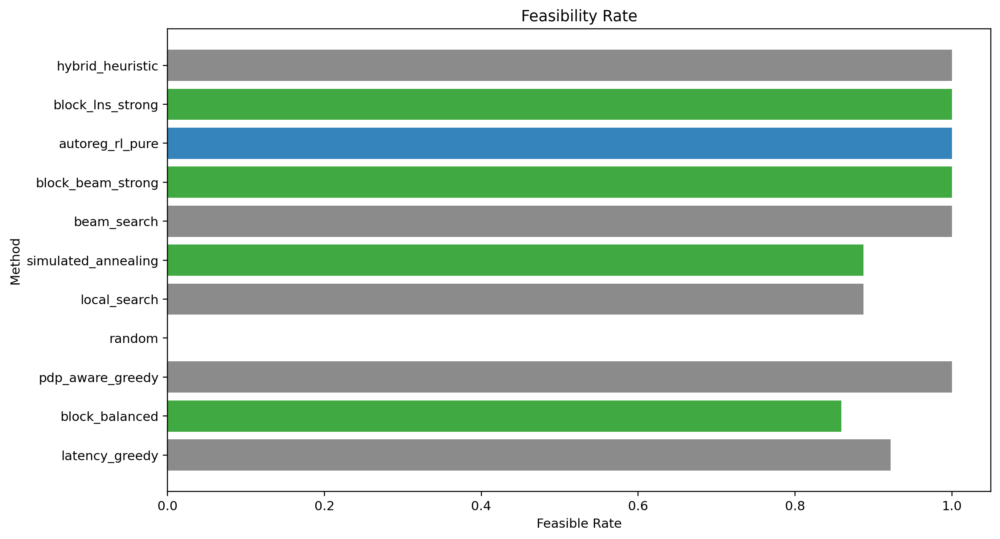
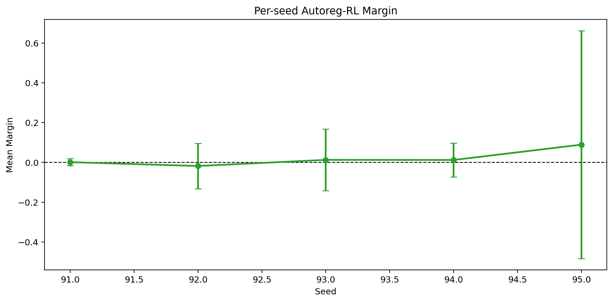
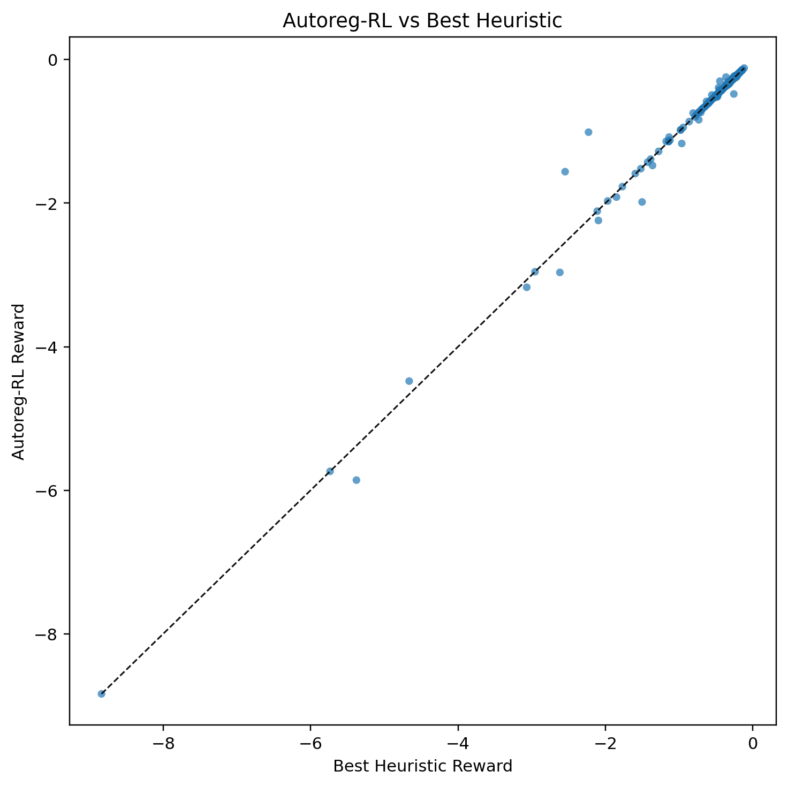

# LLM-UAV Autoregressive RL

Clean experiment repository for UAV-enabled distributed LLM submodel deployment.

The current method is a pure autoregressive RL policy for assigning Qwen3-0.6B layers to `N=5` UAVs. At inference time, `autoreg_rl_pure` samples candidates only from the learned policy and applies generic feasibility projection. Strong heuristics are used only as benchmark baselines; their actions are not inserted into the RL candidate pool.

## Current Result

Latest benchmark: `5 seeds x 64 states = 320 states`, `28` LLM layers, real Qwen3-0.6B layer-calibrated profile, CUDA inference.

Checkpoint: `results/autoreg_rl_layer_calibrated_hard_k256/autoreg_policy_best.pt`

Main benchmark: `results/benchmark_layer_calibrated_hard_k256_5seed`

Reward for feasible deployments:

```text
reward = -cost
cost = alpha * ((PPL_hat - PPL_ref) / PPL_ref) + beta * (latency_s / latency_ref_s)
```

Hard-infeasible deployments receive `reward = -100.0`. The calibrated config uses `alpha = 0.4`, `beta = 0.6`, `latency_ref_s = 6.0`, and `PPL_ref = 30.811979`.

## RL Principle

The decision variable is a layer assignment vector. For a 28-layer model and 5 UAVs, the action is:

```text
a = [u_0, u_1, ..., u_27], where u_l in {0, 1, 2, 3, 4}
```

The observation contains the current wireless channel matrix, packet-drop matrix, UAV compute/memory/energy resources, and the previous layer placement. The policy is autoregressive: it assigns one layer at a time, and each step is conditioned on the global state, the current layer features, the previous assigned UAV, and the memory already used on each UAV.

During training, the policy samples `k=256` candidate assignments per state. The simulator evaluates all candidates with the same reward used in the benchmark. The highest-reward candidates are used for policy-gradient updates and self-imitation replay. Hard-state weighted replay increases the probability of revisiting states where the previous RL policy lost to the best non-RL baseline, with larger weights for larger losses.

During inference, `autoreg_rl_pure` still uses only candidates generated by the learned autoregressive policy, followed by generic feasibility projection. Strong heuristics are evaluated only as baselines and are not inserted into the RL candidate pool.

## Surrogate Principle

The paper defines PPL as token-level perplexity:

```text
PPL = exp(-1/M * sum_k log P_LLM(w_k | w_1, ..., w_{k-1}))
```

This repository now computes real Qwen3-0.6B PPL with that explicit formula. The simulator then uses a real-LLM-calibrated analytic surrogate:

```text
PPL_hat = PPL_ref * exp(sum_l gamma_l * residual_l)
residual_l = p_l^(r + 1)
```

Here `p_l` is the packet drop probability on the wireless boundary after layer `l`, and `r` is the retransmission count. `gamma_l` is not hand-written: it is fitted by loading Qwen3-0.6B, corrupting each boundary layer's hidden states at controlled drop rates, and measuring the resulting real PPL. The fitted layer sensitivities are stored in `results/qwen3_0p6b_real_profile/layer_ppl_gamma.npy`.

Profile calibration:

| item | value |
|---|---:|
| model | `Qwen/Qwen3-0.6B` |
| parameters | 596,049,920 |
| layers | 28 |
| hidden size | 1024 |
| dtype | bfloat16 |
| reference PPL | 30.811979 |
| embedding-curve gamma | 10.898646 |
| embedding-curve R2 | 0.997363 |
| layer gamma sum | 293.322997 |
| layer mean R2 | 0.982527 |
| layer RMSE log-ratio | 0.018681 |

## Benchmark

The current policy is trained with `k=256` candidates and hard-state weighted replay. Hard states are the benchmark states where the previous pure RL policy lost to the best non-RL baseline; they are sampled more often during training and weighted by loss size. This changes the training distribution only. At inference time, `autoreg_rl_pure` still samples candidates only from the learned policy and does not insert strong heuristic actions.

The strongest baseline set includes `hybrid_heuristic`, `block_lns_strong`, `block_beam_strong`, `beam_search`, `simulated_annealing`, `local_search`, `pdp_aware_greedy`, `latency_greedy`, `block_balanced`, and `random`. Runtime is measured separately for every method.

| method | reward | feasible | latency | PPL | runtime_s | margin | win/tie |
|---|---:|---:|---:|---:|---:|---:|---:|
| autoreg_rl_pure_k256_hard | -0.497273 +/- 0.791419 | 1.0000 | 2.6278 | 48.8752 | 0.03475 | 0.001844 | 0.8125 |
| hybrid_heuristic | -0.499117 +/- 0.787499 | 1.0000 | 2.6578 | 48.7862 | 0.01226 |  |  |
| block_lns_strong | -0.499191 +/- 0.787523 | 1.0000 | 2.6519 | 48.8368 | 0.06524 |  |  |
| block_beam_strong | -0.584792 +/- 1.109608 | 1.0000 | 2.7353 | 54.7887 | 0.30765 |  |  |
| simulated_annealing | -13.754920 +/- 31.010895 | 0.8906 | 18.0197 | 1.3716e29 | 0.00682 |  |  |
| local_search | -13.771714 +/- 31.006918 | 0.8906 | 18.0157 | 1.3716e29 | 0.01457 |  |  |
| beam_search | -17.326284 +/- 290.588877 | 1.0000 | 2.8847 | 1343.2341 | 0.03031 |  |  |
| random | -100.000000 +/- 0.000000 | 0.0000 | 110.9442 | 5.0923e32 | 0.02311 |  |  |
| pdp_aware_greedy | -1076.841052 +/- 10055.860361 | 0.9969 | 3.4499 | 1338960.5587 | 0.00033 |  |  |
| block_balanced | -13061686.697982 +/- 112969291.344464 | 0.8281 | 14.6489 | 4.0152e12 | 0.00008 |  |  |
| latency_greedy | -127873524.298005 +/- 952102671.473644 | 0.9250 | 9.7239 | 3.7472e10 | 0.00007 |  |  |

Hard-state replay changed the mean margin from `-0.000632` to `+0.001844` and the win/tie rate from `0.7781` to `0.8125`. On the 71 replayed hard states, mean margin improved from `-0.047767` to `-0.025147`.

Pre-hard-replay candidate-budget sweep:

| k | mean margin | min margin | win/tie | strict win | runtime_s |
|---:|---:|---:|---:|---:|---:|
| 16 | -0.13527882 | -13.85941523 | 0.3656 | 0.0625 | 0.02870 |
| 64 | -0.04158387 | -7.88135706 | 0.5781 | 0.1062 | 0.03312 |
| 128 | -0.00694286 | -1.12779709 | 0.6750 | 0.1344 | 0.03698 |
| 256 | -0.00063242 | -1.06510871 | 0.7781 | 0.1500 | 0.04297 |

Under the stricter layer-wise PPL surrogate, `k=256` with hard-state weighted training is the recommended operating point. It beats the best strong heuristic on mean reward while using only learned-policy candidates, and it has lower mean latency than the top heuristic.

## Real LLM Validation

Action-level validation loads Qwen3-0.6B and computes real PPL for actual actions selected by RL and strong heuristics. The validation is stored in `results/real_action_ppl_validation_layer_calibrated_retrained`.

| scope | rows | mean rel error | max rel error | RMSE log-ratio | Pearson | Spearman |
|---|---:|---:|---:|---:|---:|---:|
| non-random competitive | 64 | 0.023323 | 0.216265 | 0.052984 | 0.996233 | 0.973764 |

Per method:

| method | rows | mean rel error | max rel error | Pearson | Spearman |
|---|---:|---:|---:|---:|---:|
| autoreg_rl_pure | 16 | 0.024563 | 0.113034 | 0.998831 | 0.973529 |
| block_beam_strong | 16 | 0.026895 | 0.216265 | 0.997296 | 0.970588 |
| block_lns_strong | 16 | 0.024521 | 0.199763 | 0.997366 | 0.976471 |
| hybrid_heuristic | 16 | 0.017314 | 0.134010 | 0.998837 | 0.976471 |

Random high-transition actions are kept in the report as out-of-distribution stress cases. They can exceed the calibrated drop range and produce very large exponential extrapolation errors, so the main validation metric is the non-random competitive subset.

## Visuals










## Surrogate Benchmark

The surrogate benchmark is stored in `results/surrogate_benchmark`. It validates the exponential PPL model against measured Qwen3-0.6B PPL under controlled corruption before the simulator benchmark and real action-level validation.

| metric | value |
|---|---:|
| PPL_ref | 30.811979 |
| gamma | 10.898646 |
| layer gamma sum | 293.322997 |
| layer mean R2 | 0.982527 |
| R2 log-ratio | 0.997363 |
| RMSE log-ratio | 0.019289 |
| MAE PPL | 0.797233 |
| mean relative PPL error | 0.015285 |
| max relative PPL error | 0.030760 |

## Reproduce

Train a clean policy with the current environment and surrogate:

```powershell
python -m src.train_autoreg_rl `
  --config configs/qwen3_calibrated.yaml `
  --real-dir results/qwen3_0p6b_real_profile `
  --out results/autoreg_rl_layer_calibrated_hard_k256 `
  --device cuda `
  --episodes 800 `
  --batch-states 32 `
  --candidates 256 `
  --eval-candidates 256 `
  --validation-states 128 `
  --teacher-states 0 `
  --teacher-updates 0 `
  --projection-mode blocks `
  --max-blocks 5 `
  --candidate-mode beam `
  --beam-temperature 1.0
```

The released checkpoint was additionally fine-tuned with hard-state weighted replay. The replayed hard states are recorded in `results/autoreg_rl_layer_calibrated_hard_k256/hard_states_used.csv`; older intermediate benchmark directories are intentionally not tracked.

Run the recommended `k=256` benchmark:

```powershell
python -m src.benchmark_real_profile `
  --config configs/qwen3_calibrated.yaml `
  --real-dir results/qwen3_0p6b_real_profile `
  --policy results/autoreg_rl_layer_calibrated_hard_k256/autoreg_policy_best.pt `
  --states 64 `
  --seeds "91,92,93,94,95" `
  --beam-width 32 `
  --anneal-steps 128 `
  --autoreg-candidates 256 `
  --autoreg-refine-steps 0 `
  --projection-mode blocks_fast `
  --max-blocks 5 `
  --candidate-mode beam `
  --beam-temperature 1.0 `
  --out results/benchmark_layer_calibrated_hard_k256_5seed `
  --device cuda
```

Run real action-level PPL validation:

```powershell
python -m src.benchmark_real_action_ppl `
  --config configs/qwen3_calibrated.yaml `
  --llm-config configs/real_llm.yaml `
  --real-dir results/qwen3_0p6b_real_profile `
  --policy results/autoreg_rl_layer_calibrated_hard_k256/autoreg_policy_best.pt `
  --states 16 `
  --repeats 2 `
  --batch-size 4 `
  --methods "autoreg_rl_pure,hybrid_heuristic,block_lns_strong,block_beam_strong,random" `
  --autoreg-candidates 256 `
  --beam-width 32 `
  --anneal-steps 128 `
  --out results/real_action_ppl_validation_layer_calibrated_retrained
```

Regenerate visuals:

```powershell
python -m src.make_visuals `
  --train-dir results/autoreg_rl_layer_calibrated_hard_k256 `
  --benchmark-dir results/benchmark_layer_calibrated_hard_k256_5seed `
  --out results/visuals_layer_calibrated_hard_k256
```

## Repository Layout

- `src/autoreg_rl_agent.py`: masked autoregressive policy for layer-to-UAV assignment.
- `src/train_autoreg_rl.py`: RL/self-imitation training.
- `src/baselines.py`: greedy, local search, beam search, simulated annealing, block LNS, and hybrid heuristics.
- `src/env.py`: LLM-UAV simulator, constraints, reward, and KKT bandwidth allocation.
- `src/real_llm_profile.py`: Qwen3-0.6B profile and explicit paper-formula PPL calibration.
- `src/real_llm_layer_calibration.py`: layer-wise real PPL sensitivity calibration.
- `src/benchmark_real_profile.py`: simulation benchmark with strong baselines.
- `src/benchmark_real_action_ppl.py`: real action-level Qwen PPL validation.
- `configs/qwen3_calibrated.yaml`: calibrated simulation config.

## Setup

```powershell
conda create -n LLM-UAV python=3.11 -y
conda activate LLM-UAV
pip install numpy pandas pyyaml matplotlib transformers datasets
pip install torch --index-url https://download.pytorch.org/whl/cu128
```
