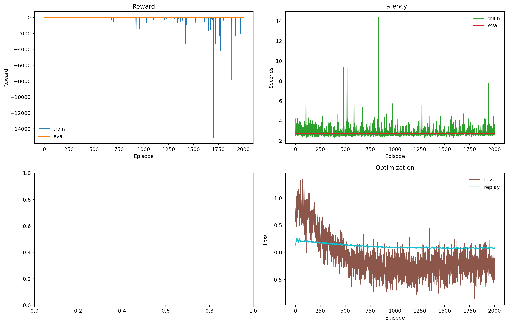
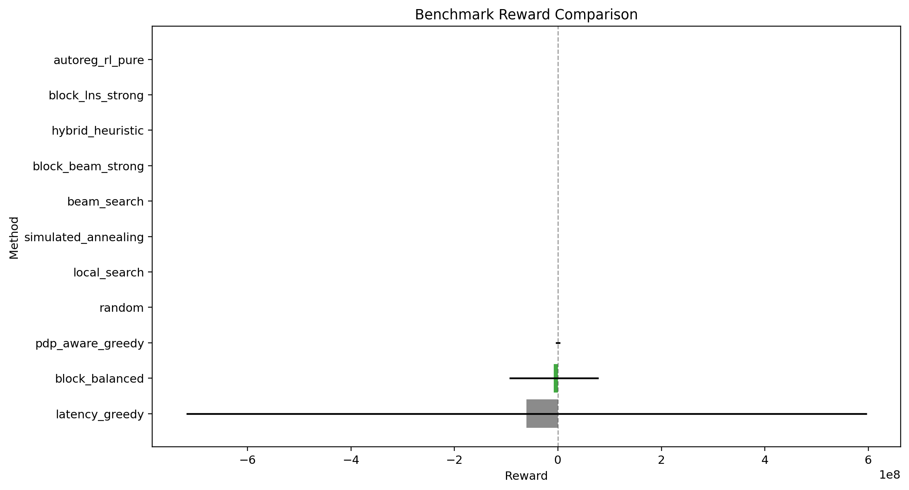
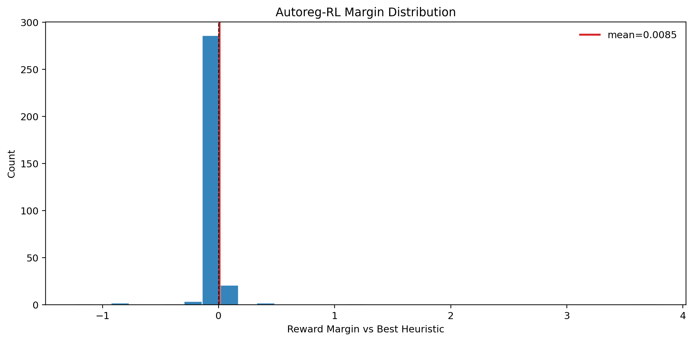
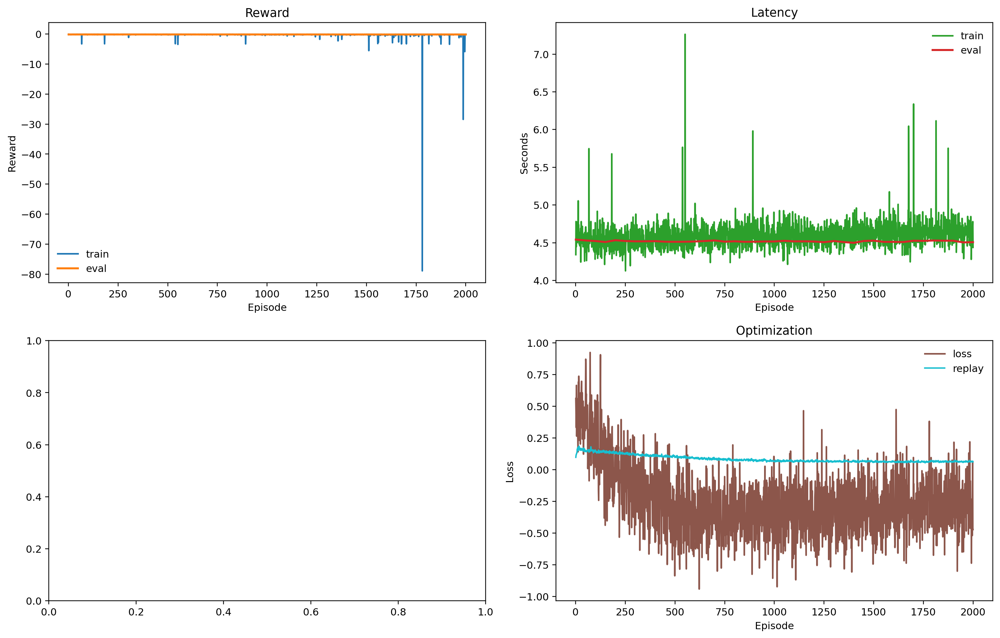
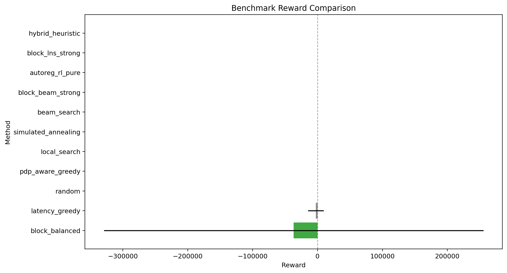
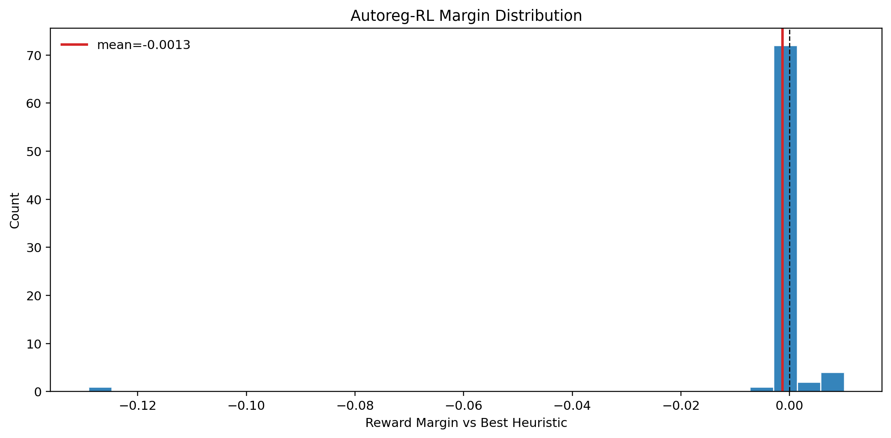
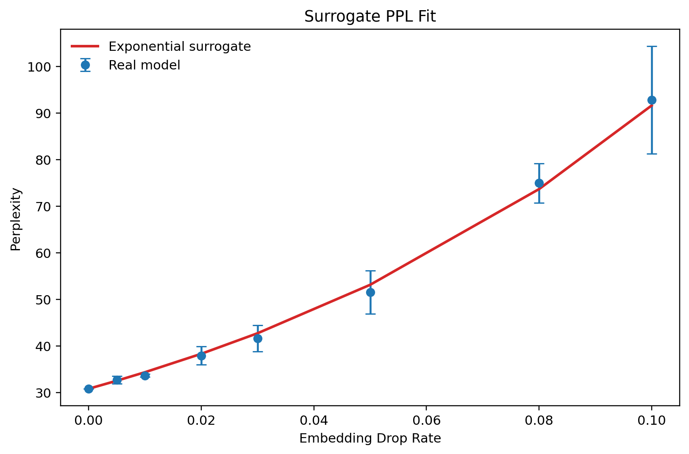
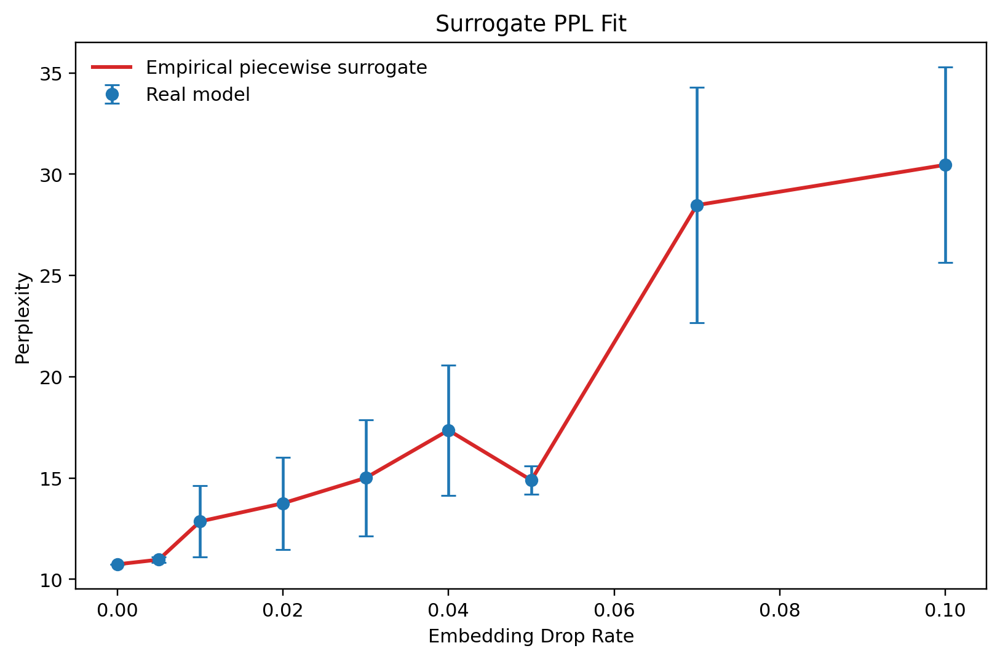

# LLM-UAV Autoregressive RL

This repository implements UAV-enabled distributed LLM layer placement with an autoregressive RL policy. The environment uses `N=5` UAVs, hard memory and energy constraints, KKT closed-form bandwidth allocation, retransmission-aware residual packet loss, and a real-LLM-calibrated PPL surrogate.

At inference time, `autoreg_rl_pure` samples candidate layer assignments only from the learned policy and applies generic feasibility projection. Strong heuristics are benchmark baselines only; their actions are not inserted into the RL candidate pool.

## Current Status

Three model profiles are tracked:

| model | status | policy checkpoint | benchmark |
|---|---|---|---|
| `Qwen/Qwen3-0.6B` | main validated result | `results/autoreg_rl_layer_calibrated_hard_k256/autoreg_policy_best.pt` | `results/benchmark_layer_calibrated_hard_k256_5seed` |
| `Qwen/Qwen3.5-4B` | larger-model experimental result | `results/autoreg_rl_qwen35_4b_v2_teacher_big/autoreg_policy_best.pt` | `results/benchmark_qwen35_4b_v2_teacher_big_5seed` |
| `google/gemma-4-E4B` | base-model exploratory result with curve surrogate | `results/autoreg_rl_gemma4_e4b_teacher/autoreg_policy_best.pt` | `results/benchmark_gemma4_e4b_teacher` |

Gemma now uses a denser real-LLM embedding-drop profile and an empirical piecewise curve surrogate. Qwen3-0.6B remains the strongest paper-ready line because it also has layer-wise calibration and real action-level validation.

## Observation, Action, Reward

For Qwen3-0.6B, `N=5` and `L=28`, so the flattened base observation is `R^93`:

| component | shape | dim | normalization |
|---|---:|---:|---|
| SNR matrix | `N x N` | 25 | `log1p(snr) / log1p(1e6)` |
| packet-drop probability matrix | `N x N` | 25 | raw probability |
| UAV compute capacity | `N` | 5 | `compute_hz / 1e10` |
| UAV memory capacity | `N` | 5 | `mem_bytes / 512 MiB` |
| UAV energy budget | `N` | 5 | `energy_j / 2000` |
| previous layer placement | `L` | 28 | `previous_uav_id / (N - 1)` |

At each autoregressive step, the policy adds layer features and partial-assignment context:

| step input | dim |
|---|---:|
| encoded base observation | 512 |
| layer features: memory, cycles, previous activation, next activation, importance, position | 6 |
| previous assigned UAV one-hot | 5 |
| normalized memory used per UAV | 5 |
| layer index fraction | 1 |
| remaining memory fraction | 1 |

The action is a layer-to-UAV vector:

```text
a = [u_0, u_1, ..., u_{L-1}], where u_l in {0, 1, 2, 3, 4}
```

For feasible deployments:

```text
reward = -cost
cost = alpha * ((PPL_hat - PPL_ref) / PPL_ref) + beta * (latency_s / latency_ref_s)
```

The released configs use `alpha = 0.4`, `beta = 0.6`, one retransmission, and `infeasible_reward = -100.0`. The retransmission setting affects both expected communication latency and the residual activation-loss probability:

```text
residual_l = p_l^(r + 1)
```

With `r = 1`, PPL damage uses `p_l^2` rather than raw PDP.

## RL Method

Training uses policy sampling, environment scoring, policy-gradient updates, and self-imitation replay. Larger runs use teacher warm-start: strong heuristics generate replay targets before RL continues optimizing the same reward. This improves learning but does not change inference fairness, because benchmark-time `autoreg_rl_pure` still uses only learned-policy candidates.

The default high-quality inference setting uses beam policy candidates with `k=256`.

## Surrogate Principle

The paper-formula PPL is:

```text
PPL = exp(-1/M * sum_k log P_LLM(w_k | w_1, ..., w_{k-1}))
```

The simulator uses a calibrated surrogate:

```text
PPL_hat = PPL_ref * exp(sum_l gamma_l * residual_l)
residual_l = p_l^(r + 1)
```

A boundary contributes PPL damage only when adjacent layers are placed on different UAVs. The layer sensitivity `gamma_l` is fitted by loading the real LLM, corrupting hidden states at controlled drop rates, and measuring real PPL.

For Gemma-4-E4B, the single exponential baseline is not expressive enough because sampled corruption trials produce a noisy non-linear curve. Gemma therefore uses:

```text
damage = sum_l importance_l * residual_l
PPL_hat = PPL_ref * exp(f_curve(damage))
```

where `f_curve` is an empirical piecewise interpolation fitted from the real Gemma PPL corruption curve. The report still records the old exponential baseline R2 separately.

This is a curve fit on sampled corruption points, not a layer-wise analytic calibration.

## Simulator Benchmarks

These are the main policy-comparison benchmarks. PPL is `PPL_hat`, not an online real-LLM call. The table below is generated by the commands in [Reproduce](#reproduce). Runtime is machine-dependent; reward, feasibility, latency, and PPL should match the tracked `benchmark_rows.csv` files.

| model | artifact | states | RL reward | best non-RL reward | latency | PPL_hat | RL runtime | mean margin | win/tie |
|---|---|---:|---:|---:|---:|---:|---:|---:|---:|
| Qwen3-0.6B | `results/benchmark_layer_calibrated_hard_k256_5seed` | 320 | -0.582559 | -0.591107 | 2.6099 | 55.5828 | 0.07472 | +0.008548 | 0.7844 |
| Qwen3.5-4B | `results/benchmark_qwen35_4b_v2_teacher_big_5seed` | 80 | -0.166181 | -0.164903 | 4.4404 | 13.4099 | 0.05481 | -0.001278 | 0.8750 |
| Gemma-4-E4B | `results/benchmark_gemma4_e4b_teacher` | 192 | -0.278327 | -0.278862 | 9.2074 | 10.8012 | 0.07182 | +0.000534 | 0.7448 |

Strong non-RL baselines include `hybrid_heuristic`, `block_lns_strong`, `block_beam_strong`, `beam_search`, `simulated_annealing`, `local_search`, `pdp_aware_greedy`, `latency_greedy`, `block_balanced`, and `random`.

### Qwen3-0.6B Methods

| method | reward | feasible | latency | PPL_hat | runtime_s |
|---|---:|---:|---:|---:|---:|
| autoreg_rl_pure | -0.582559 | 1.0000 | 2.6099 | 55.5828 | 0.07472 |
| hybrid_heuristic | -0.591107 | 1.0000 | 2.6323 | 56.0683 | 0.01283 |
| block_lns_strong | -0.591107 | 1.0000 | 2.6323 | 56.0683 | 0.06759 |
| block_beam_strong | -0.626139 | 1.0000 | 2.7118 | 58.1541 | 0.36108 |
| beam_search | -13.959931 | 1.0000 | 3.1348 | 1081.9976 | 0.05740 |

### Qwen3.5-4B Methods

| method | reward | feasible | latency | PPL_hat | runtime_s |
|---|---:|---:|---:|---:|---:|
| block_lns_strong | -0.164903 | 1.0000 | 4.4400 | 13.3706 | 0.05874 |
| hybrid_heuristic | -0.164903 | 1.0000 | 4.4400 | 13.3706 | 0.01388 |
| autoreg_rl_pure | -0.166181 | 1.0000 | 4.4404 | 13.4099 | 0.05481 |
| block_beam_strong | -0.166586 | 1.0000 | 4.4711 | 13.3939 | 0.69404 |
| beam_search | -0.742398 | 1.0000 | 4.7914 | 30.9303 | 0.06953 |

### Gemma-4-E4B Methods

| method | reward | feasible | latency | PPL_hat | runtime_s |
|---|---:|---:|---:|---:|---:|
| autoreg_rl_pure | -0.278327 | 1.0000 | 9.2074 | 10.8012 | 0.07182 |
| hybrid_heuristic | -0.278862 | 1.0000 | 9.2292 | 10.7980 | 0.01851 |
| block_lns_strong | -0.278862 | 1.0000 | 9.2292 | 10.7980 | 0.06608 |
| block_beam_strong | -0.281125 | 1.0000 | 9.3036 | 10.7988 | 0.68703 |
| beam_search | -0.304512 | 1.0000 | 10.0208 | 10.8491 | 0.14239 |

## Real LLM Validation

Real LLM validation recomputes paper-formula PPL for selected deployment actions. It is slower than simulator benchmarking and is used to validate the surrogate.

| model | artifact | rows | mean rel error | max rel error | RMSE log-ratio | Pearson | Spearman | status |
|---|---|---:|---:|---:|---:|---:|---:|---|
| Qwen3-0.6B | `results/real_action_ppl_validation_layer_calibrated_retrained` | 64 competitive | 0.023323 | 0.216265 | 0.052984 | 0.996233 | 0.973764 | validated |
| Qwen3.5-4B | not available | 0 | - | - | - | - | - | pending |
| Gemma-4-E4B | not available | 0 | - | - | - | - | - | pending |

## Surrogate Benchmarks

Surrogate quality is reported separately for each model. These benchmarks are calibration-set fits built from the real-LLM profile directories. They are not held-out test benchmarks: each surrogate is fit on the sampled corruption curve stored in the real profile, then scored on those same sampled corruption points.

| model | surrogate artifact | clean PPL | fit type | R2 | RMSE log-ratio | mean rel error | max rel error | interpretation |
|---|---|---:|---|---:|---:|---:|---:|---|
| Qwen3-0.6B | `results/surrogate_benchmark_qwen3_0p6b` | 30.811979 | embedding exponential + layer gamma | 0.997363 | 0.019289 | 0.015285 | 0.030760 | strong |
| Qwen3.5-4B | `results/surrogate_benchmark_qwen35_4b_v2` | 12.388740 | layer one-hot MLP | 0.999725 | 0.001998 | - | - | strongest surrogate fit |
| Gemma-4-E4B | `results/surrogate_benchmark_gemma4_e4b` | 10.744652 | empirical piecewise curve | 1.000000 | 0.000000 | 0.000000 | 0.000000 | fit R2 target met; exponential baseline R2 0.891476 |

Qwen3.5 also has a high-quality layer-wise analytic calibration: layer gamma sum `206.094048`, mean layer R2 `0.995787`, and layer RMSE log-ratio `0.006596`. Gemma's curve surrogate is fitted on 9 sampled embedding-drop points; it meets the R2 target on that curve, but it is still not a full layer-wise calibration. A compact cross-model surrogate report is stored at `results/surrogate_benchmark_multi_model_report.md`.

### How the surrogate benchmarks are built

All surrogate benchmarks use a real-LLM profile directory, then compare surrogate predictions against real PPL measured on corrupted forward passes. The table below shows the evaluation-text count and corruption grid used by each benchmark.

| model | real profile source | validation texts | corruption grid | trials per point | rows in the report | fit / evaluation |
|---|---|---:|---|---:|---:|---|
| Qwen3-0.6B | `results/qwen3_0p6b_real_profile` | 128 Wikitext-2 validation texts | 8 embedding-drop points from `0.0` to `0.1` | 6 | 8 curve points | exponential fit on `log(PPL/PPL_ref)`; report R2 and relative error on the sampled calibration points |
| Qwen3.5-4B | `results/qwen35_4b_real_profile_v2` | 64 Wikitext-2 validation texts | 31 boundary layers x 5 positive layer-drop points | 3 | 155 layer rows | layer-wise calibration plus layer-onehot MLP; report layer R2 and MLP R2 on the calibration rows |
| Gemma-4-E4B | `results/gemma4_e4b_real_profile` | 16 Wikitext-2 validation texts | 9 embedding-drop points from `0.0` to `0.1` | 3 | 9 curve points | linear baseline plus empirical piecewise curve over a scalar damage proxy; report both R2 values on the calibration grid |

For Qwen3-0.6B and Gemma-4-E4B, the benchmark uses embedding-drop corruption directly on the input embedding layer. For Qwen3.5-4B, the benchmark uses layer-wise hidden-state corruption and then trains the MLP surrogate on the resulting `layer_ppl_curve.json`. The reported `R2` values are calibration R2 values, not a separate held-out test-set score.

Qwen3-0.6B uses the exact drop grid `[0.0, 0.005, 0.01, 0.02, 0.03, 0.05, 0.08, 0.1]` from `configs/real_llm.yaml`. Gemma-4-E4B uses a denser empirical grid in `results/gemma4_e4b_real_profile/ppl_corruption_curve.json`; the piecewise fit reaches `R2 = 1.0` on those sampled points, but that is interpolation on the calibration curve, not an unseen generalization score.

## Visuals

### Qwen3-0.6B







### Qwen3.5-4B







### Surrogate





## Reproduce

The tracked repository is sufficient to run the simulator, load the released
checkpoints, regenerate surrogate-fit reports, launch RL training, and reproduce
the simulator benchmark tables above. The benchmark directories now include
`benchmark_rows.csv`, so the reported aggregate metrics can be recomputed from
the tracked per-state rows.

Expected reproducibility scope:

| target | status | notes |
|---|---|---|
| Code import / compilation | reproducible | `python -m compileall -q src` should pass. |
| Surrogate benchmark from tracked profiles | reproducible | Regenerates the reported Qwen3-0.6B and Gemma curve-fit metrics. |
| Checkpoint benchmark rerun | reproducible | Use the commands below and compare with the tracked `benchmark_summary.csv` and `benchmark_margin.json`. |
| Full RL training | runnable, stochastic | Long run; final policy is not guaranteed to match the released checkpoint exactly. |
| Real LLM validation | hardware/model-cache dependent | Requires loading the requested Hugging Face model locally. |

Train Qwen3-0.6B:

```powershell
python -m src.train_autoreg_rl `
  --config configs/qwen3_calibrated.yaml `
  --out results/autoreg_rl_qwen3_0p6b_teacher_big `
  --device cuda `
  --episodes 2000 `
  --batch-states 32 `
  --candidates 256 `
  --eval-candidates 256 `
  --teacher-states 1000 `
  --teacher-updates 1000 `
  --projection-mode blocks `
  --max-blocks 5 `
  --candidate-mode beam
```

Benchmark a trained policy:

Qwen3-0.6B:

```powershell
python -m src.benchmark_real_profile `
  --config configs/qwen3_calibrated.yaml `
  --policy results/autoreg_rl_layer_calibrated_hard_k256/autoreg_policy_best.pt `
  --states 64 `
  --seeds "91,92,93,94,95" `
  --beam-width 32 `
  --anneal-steps 128 `
  --autoreg-candidates 256 `
  --out results/benchmark_layer_calibrated_hard_k256_5seed `
  --device cuda
```

Expected summary: `autoreg_rl_pure` reward `-0.582559`, `PPL_hat` `55.5828`, win/tie `0.7844`.

Qwen3.5-4B:

```powershell
python -m src.benchmark_real_profile `
  --config configs/qwen35_4b_calibrated.yaml `
  --real-dir results/qwen35_4b_real_profile_v2 `
  --policy results/autoreg_rl_qwen35_4b_v2_teacher_big/autoreg_policy_best.pt `
  --states 16 `
  --seeds "91,92,93,94,95" `
  --beam-width 32 `
  --anneal-steps 128 `
  --autoreg-candidates 256 `
  --out results/benchmark_qwen35_4b_v2_teacher_big_5seed `
  --device cuda
```

Expected summary: `autoreg_rl_pure` reward `-0.166181`, `PPL_hat` `13.4099`, win/tie `0.8750`.

Gemma-4-E4B:

```powershell
python -m src.benchmark_real_profile `
  --config configs/gemma4_base_calibrated.yaml `
  --real-dir results/gemma4_e4b_real_profile `
  --policy results/autoreg_rl_gemma4_e4b_teacher/autoreg_policy_best.pt `
  --states 64 `
  --seeds "91,92,93" `
  --beam-width 32 `
  --anneal-steps 128 `
  --autoreg-candidates 256 `
  --out results/benchmark_gemma4_e4b_teacher `
  --device cuda
```

Expected summary: `autoreg_rl_pure` reward `-0.278327`, `PPL_hat` `10.8012`, win/tie `0.7448`.

Run a surrogate benchmark:

```powershell
python -m src.benchmark_surrogate `
  --real-dir results/qwen3_0p6b_real_profile `
  --out results/surrogate_benchmark_qwen3_0p6b
```

The surrogate benchmark is deterministic from the tracked profile files. For
Qwen3-0.6B, this should reproduce an exponential-fit `R2` around `0.997363`.
For Gemma-4-E4B, the reported `R2 = 1.0` is interpolation on the calibration
curve, not held-out generalization.

## Repository Layout

```text
.
|-- configs/
|   |-- qwen3_calibrated.yaml
|   |-- qwen35_4b_calibrated.yaml
|   |-- gemma4_base_calibrated.yaml
|   |-- real_llm.yaml
|   |-- real_llm_qwen35_4b.yaml
|   `-- real_llm_gemma4_base.yaml
|-- src/
|   |-- env.py
|   |-- channel.py
|   |-- llm_profile.py
|   |-- autoreg_rl_agent.py
|   |-- train_autoreg_rl.py
|   |-- baselines.py
|   |-- benchmark_real_profile.py
|   |-- benchmark_real_action_ppl.py
|   |-- benchmark_surrogate.py
|   |-- real_llm_profile.py
|   |-- real_llm_layer_calibration.py
|   `-- reports/
|       |-- make_autoreg_report.py
|       |-- make_k_sweep_report.py
|       |-- make_multi_model_surrogate_report.py
|       `-- make_visuals.py
|-- results/
|   |-- qwen3_0p6b_real_profile/
|   |-- qwen35_4b_real_profile_v2/
|   |-- gemma4_e4b_real_profile/
|   |-- autoreg_rl_layer_calibrated_hard_k256/
|   |-- autoreg_rl_qwen35_4b_v2_teacher_big/
|   |-- autoreg_rl_gemma4_e4b_teacher/
|   |-- benchmark_layer_calibrated_hard_k256_5seed/
|   |-- benchmark_qwen35_4b_v2_teacher_big_5seed/
|   |-- benchmark_gemma4_e4b_teacher/
|   |-- real_action_ppl_validation_layer_calibrated_retrained/
|   |-- surrogate_benchmark_qwen3_0p6b/
|   |-- surrogate_benchmark_qwen35_4b_v2/
|   |-- surrogate_benchmark_gemma4_e4b/
|   |-- surrogate_benchmark_multi_model_report.md
|   |-- visuals_layer_calibrated_hard_k256/
|   `-- visuals_qwen35_teacher_big/
|-- requirements.txt
`-- README.md
```

Generated experiment outputs are ignored by default. The repository tracks only curated best checkpoints, profile files, benchmark summaries/reports/rows, validation reports, surrogate summaries, and README figures. Raw training logs, teacher caches, stdout/stderr logs, smoke runs, and non-best checkpoints are intentionally not tracked.

## Setup

```powershell
conda create -n LLM-UAV python=3.11 -y
conda activate LLM-UAV
pip install numpy pandas pyyaml matplotlib transformers datasets
pip install torch --index-url https://download.pytorch.org/whl/cu128
```
